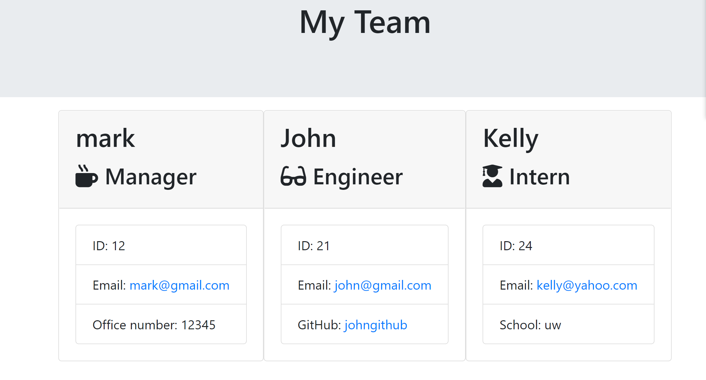

# TeamBuilder

 
Explore the [project-page](https://github.com/Mgithub89/TeamBuilder.git)

## Description
  A Node CLI Application that allows a user to 
build a team profile by using Inquirer npm package to prompt basic information of a team based on their role with the company. This App allows the user to add unlimited number of team and when the user 
choses i dont want to add any more team member the app closes and generate an HTML page in the out put folder that displays basic information about their team to be viewed in the browser. 

## Table Of Contents 
* [Installation](#Installation)
* [Usage](#Usage)
* [Technologies Used](#Technologies-Used)
* [Contributing](#Contributing)
* [Tests](#Tests)
* [License](#License)
* [Questions](#Questions)

## Installation
* fork the repo and install all the dependencies(npm i).

## usage
* Run  node app.js  into your command line
* Answer each questions prompted in the terminal.
* Add as many as you want
* When you choose i dont want to add any more html file(team.html) will be created in the output folder that contains all the provided info.
* Open team.html file in the browser.
* [A walkthrough video](https://drive.google.com/file/d/1YlF9o-d_1Gi92EQF8RIgrwzFARy5ZeNr/view) 

* snap shot

## Technologies used
* inquirer
* fs(filesystem)
* node

## Contributing
* Feel free to contribute. just contact me via email and fork my project

## Tests
* npm run test

## License 
 
 For more information about the License , click on the link below.
 * [License](https://opensource.org/licenses/MIT)

## Questions
* For Questions you can reach me at [metages09@gmail.com](mailto:metages09@gmail.com)
* visit my [github profile](https://github.com/Mgithub89)
        